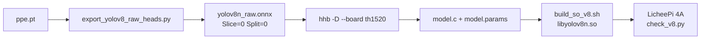

# Документация

| Файл | Содержание |
|------|------------|
| [GETTING_STARTED.md](GETTING_STARTED.md) | С нуля: скачать, экспорт, HHB, сборка, плата |
| [YOLOV8_HHB.md](YOLOV8_HHB.md) | Детали графа YOLOv8, Slice/Split, флаги HHB |
| [../README.md](../README.md) | Обзор репозитория |

## Типовой поток (YOLOv8 PPE)

