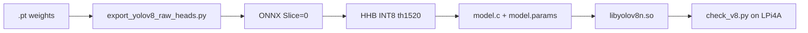

**Language / Язык:** [English](#english) · [Русский](#русский)

---

# Documentation index

| Document | Audience | Contents |
|----------|----------|----------|
| [../README.md](../README.md#english) | Everyone | Overview + **one-command** quick start |
| [../examples/](../examples/) | Board users | Prebuilt `.so` + `model.params` demos |
| [GETTING_STARTED.md](GETTING_STARTED.md#english) | Board bring-up | Webcam, acceptance checks |
| [QUANTIZATION.md](QUANTIZATION.md#english) | ML / embedded | Full `.pt` → ONNX → HHB → `.so` |
| [LIB_YOLOV5N.md](LIB_YOLOV5N.md#english) | Integrators | `libyolov5n.so` specification |
| [LIB_YOLOV8.md](LIB_YOLOV8.md#english) | Integrators | `libyolov8n.so` specification |
| [YOLOV8_HHB.md](YOLOV8_HHB.md#english) | Export / HHB | YOLOv8 graph checklist |

**Internationalization:** English and Russian live in the **same** Markdown file.
Use the **Language / Язык** links at the top of each page. There are no `*_ru.md` duplicates.

## YOLOv8 pipeline

---

# Оглавление документации

**[↑ English](#english)** · **Русский**

| Документ | Аудитория | Содержание |
|----------|-----------|------------|
| [../README.md](../README.md#русский) | Все | Обзор + быстрый старт **одной командой** |
| [../examples/](../examples/) | Пользователи платы | Готовые `.so` + `model.params` |
| [GETTING_STARTED.md](GETTING_STARTED.md#русский) | Вывод на плату | Камера, критерии приёмки |
| [QUANTIZATION.md](QUANTIZATION.md#русский) | ML / embedded | Полный путь `.pt` → ONNX → HHB → `.so` |
| [LIB_YOLOV5N.md](LIB_YOLOV5N.md#русский) | Интеграторы | Спецификация `libyolov5n.so` |
| [LIB_YOLOV8.md](LIB_YOLOV8.md#русский) | Интеграторы | Спецификация `libyolov8n.so` |
| [YOLOV8_HHB.md](YOLOV8_HHB.md#русский) | Экспорт / HHB | Чеклист графа YOLOv8 |

**Локализация:** английский и русский — в **одном** Markdown-файле.
Переключение — ссылками **Language / Язык** в начале страницы. Файлы вида `*_ru.md` не создаются.

Схема пайплайна YOLOv8 — в секции English выше.
